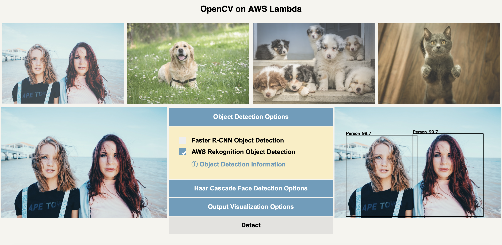

# OpenCV Object Detection on AWS Lambda

Serverless Object Detection using OpenCV on AWS Lambda. Compare AWS Rekognition, OpenCV DNN, and OpenCV Haar Cascades image results directly. 

Sample Human Image Input:

Sample Human Image Output:

OpenCV Object Detection on AWS Lambda places black bounding boxes around the humans found by AWS Rekognition. The 99.7 is AWS Rekognition's confidence level that this is a person. 

The white bounding boxes around the humans is from OpenCV's Deep Neural Network (DNN). The DNN, in this project, uses the "Faster RCNN Inception Version 2" model. However, you can use any OpenCV DNN compatible model you'd like. This DNN model shows a slightly lower confidence for the humans at 98.5 and 92.2.

The blue bounding boxes shows the OpenCV Haar Cascade for faces. This is an older technology, and not nearly as accurate as neural networks for image detection. The Haar Cascades work best if the picture is already known to contain faces, or dogs, or cats. 

Sample Dog Image Input:

Sample Dog Image Output:

# How to Use

1. Click the "OpenCV Object Detection Launch Stack" button:

This will bring you to either the Cloudformation UI or the AWS console if you are not signed in. Sign in, if you are not already. From the Cloudformation UI, click "Next" at the bottom of the screen. Repeat clicking "Next" on the two following pages. You will reach a page with this towards the bottom:

&nbsp;

Checkmark the three "I acknowledgement" statements and select "Create Stack." This will start building the CloudFormation stack.

&nbsp;

2) Navigate to S3. You should see a bucket named "opencv-demo-xxxxxxxx", where "xxxxxxxx" is the unique stack identifier from CloudFormation. Open this bucket. You will see an "index.html" file. Open this file. This webpage will appear:

&nbsp;

If you select the "Object Detections Options" or "Haar Cascade Face Detection Options", you can control which object detection models or Haar Cascade models you use. The "Output Visualization Options" allows you to control the output image appearance and set a minimum confidence threshold for the AWS Rekognition and OpenCV DNN models. The minimum confidence threshold for the Haar Cascade models is 50%.

&nbsp;

3) Select a photo. Either select one of the stock photos or upload your own image. Select "Detect," if you uploaded an image or changed the image detection options.

&nbsp;

4) Congratulations! It's that easy.

&nbsp;

# Questions

Any questions or suggestions, just add an "Issues" submission to this repository. Thanks.

&nbsp;

Happy Coding!
